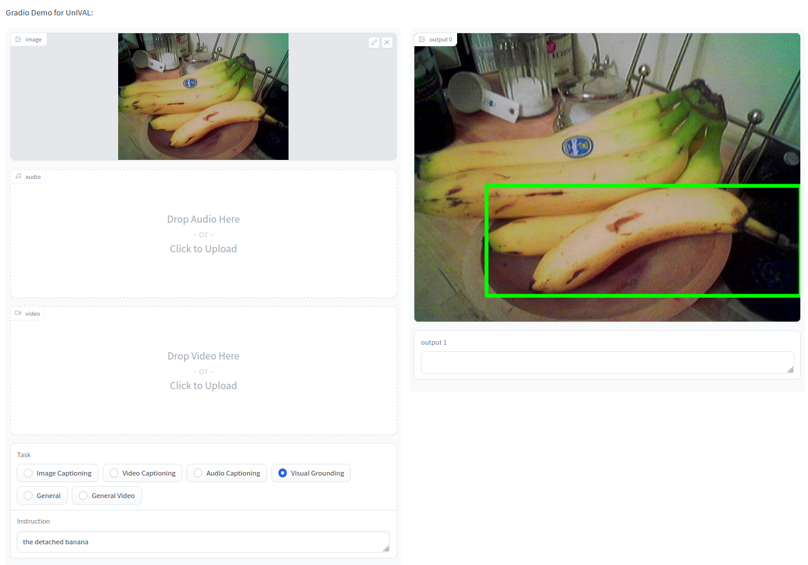
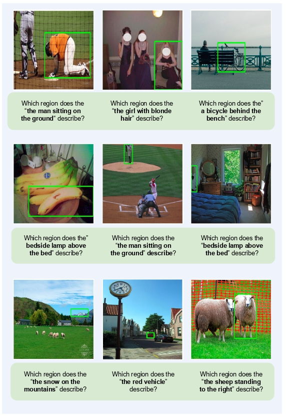
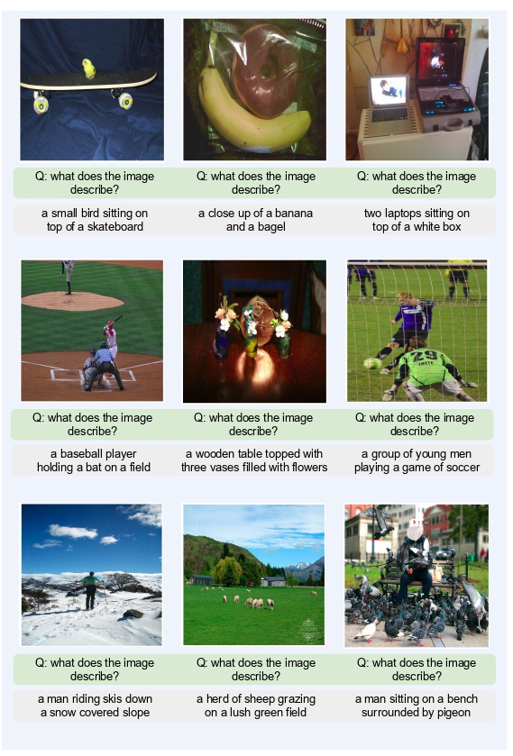
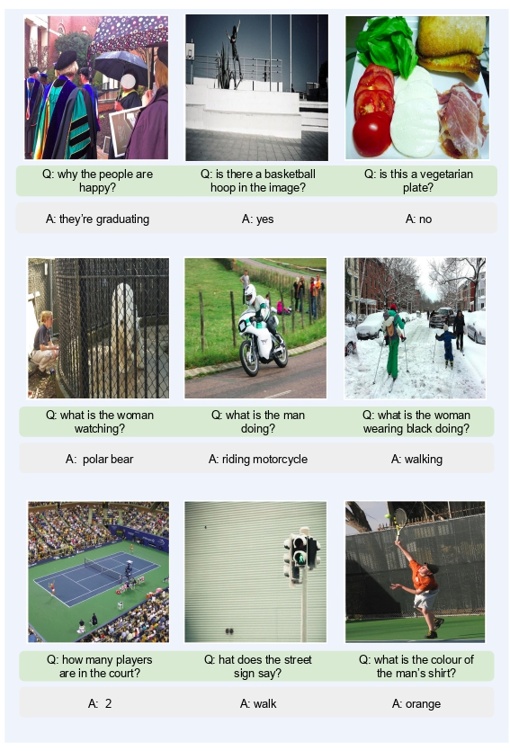

<!---
Modified from OFA code.
Copyright 2022 The OFA-Sys Team. 
All rights reserved.
This source code is licensed under the Apache 2.0 license found in the LICENSE file in the root directory.
-->


<p align="center">
    <br>
    
    <br>
<p>


<p align="center">
        &nbsp<a href="https://unival-model.github.io/">Project Page</a> &nbsp | &nbsp<a href="https://arxiv.org/abs/2307.16184">Paper </a>&nbsp | &nbsp<a href="https://huggingface.co/spaces/mshukor/UnIVAL">Demo</a>&nbsp | &nbsp<a href="#datasets-and-checkpoints">Checkpoints</a>&nbsp 
</p>


<p align="center">
    <br>
    
    <br>
<p>

<br></br>


**UnIVAL** <i>is a 0.25B-parameter unified model that is multitask pretrained on image and video-text data and target image, video and audio-text downstream tasks.</i>

<br></br>


# Online Demos
Check out our demo on Huggingface Spaces: [Spaces](https://huggingface.co/spaces/mshukor/UnIVAL)

<p align="center">
    <br>
    
    <br>
<p>

`General` means the pretrained model before finetuning.

To easily play with our model we also provide several notebooks: `VG.ipynb`, `VQA.ipynb`, `Captioning.ipynb`, `Video_Captioning.ipynb`, and `Audio_Captioning.ipynb`

<br></br>


# News

* **[2023.7.31]**: we provide [here](rewarded_soups.md) more details to reproduce the results with UnIVAL on Visual Grounding used in our [Rewarded soups](https://github.com/alexrame/rewardedsoups) work.
* **[2023.7.31]**: Released of UnIVAL code and model weights! We will release the scripts to train and evaluate audio/video tasks later.

<br></br>

# Table of Content

* [Quantitative Results](#results)
* [Installation](#installation)
* [Datasets and Checkpoints](#datasets-and-checkpoints)
* [Training and Inference](#training-and-inference)
* [Zero-shot Evaluation](#zero-shot-evaluation)
* [Parameter Efficient Finetuning (PEFT): Training only the linear layer](#parameter-efficient-finetuning)
* [Multimodal Model Merging/Weight Interpolation](#multimodal-model-merging)
* [Qualitative results](#qualitative-results)
* [Citation](#citation)
* [Acknowledgment](#acknowledgment)


<br></br>

# Results
Here are some results on several multimodal tasks. 

<table border="1" width="100%">
    <tr align="center">
        <th>Task</th><th colspan="3">Visual Grounding</th><th>Image Captioning</th><th>VQA</th><th>Visual Entailment</th><th colspan="1">VideoQA</th><th colspan="1">Video Captioning</th><th colspan="2">Audio Captioning</th>
    </tr>
    <tr align="center">
        <td>Dataset</td><td>RefCOCO</td><td>RefCOCO+</td><td>RefCOCOg</td><td>COCO</td><td>VQA v2</td><td>SNLI-VE</td><td>MSRVTT-QA</td><td>MSRVTT</td><td>AudioCaps</td>
    </tr>
    <tr align="center">
        <td>Split</td><td>val/test-a/test-b</td><td>val/test-a/test-b</td><td>val-u/test-u</td><td>Karpathy test</td><td>test-dev/test-std</td><td>val/test</td><td>test</td><td>test</td><td>test</td>
    </tr>
    <tr align="center">
        <td>Metric</td><td colspan="3">Acc.</td><td>CIDEr</td><td>Acc.</td><td>Acc.</td><td>Acc.</td><td>CIDEr</td><td>CIDEr</td>
    </tr>
    <tr align="center">
        <td>UnIVAL</td><td>89.1 / 91.5 / 85.2</td><td>82.2 / 86.9 / 75.3</td><td>84.7 / 85.2</td><td>137.0</td><td>77.0 / 77.1</td><td>78.2 / 78.6</td><td>43.5</td><td>60.5</td><td>71.3</td>
    </tr>
</table>
<br></br>


# Installation

## Requirements
* python 3.7.4
* pytorch 1.13+
* torchvision 0.14.1+
* JAVA 1.8 (for COCO evaluation)

We recommend to first install pytorch before other libraries:

```bash
git clone https://github.com/mshukor/UnIVAL.git
pip install -r requirements.txt
```

Download the following model for captioning evaluation:
```
python -c "from pycocoevalcap.spice.spice import Spice; tmp = Spice()"
```

<br></br>


# Datasets and Checkpoints
See [datasets.md](datasets.md) and [checkpoints.md](checkpoints.md).
<br></br>


# Training and Inference
The scripts to launch pretraining, finetuning and evaluation can be found in `run_scripts/` folder. Below we provide more details. The data are stored in `.tsv` files with different format depending on the training task. 
To restore training you need to provide the last checkpoint <code>checkpoint_last.pt</code> to <code>--restore-file</code>, and pass <code>--reset-dataloader --reset-meters --reset-optimizer</code> as argument.

We use slurm to launch the training/evaluation.


## Image Processing
In some datasets, the images are encoded to base64 strings.
To do this transformation you can use the following code:
```python
from PIL import Image
from io import BytesIO
import base64

img = Image.open(file_name) # path to file
img_buffer = BytesIO()
img.save(img_buffer, format=img.format)
byte_data = img_buffer.getvalue()
base64_str = base64.b64encode(byte_data) # bytes
base64_str = base64_str.decode("utf-8") # str
```

## Pretraining

<details>
    <summary><b>1. Prepare the Dataset</b></summary>
    <p>
        The format for pretraining tsv files are as follows: 
        <br />
        <ul type="circle">
            <li>
    Each line contains uniq-id, image/video path, caption, question, answer, ground-truth objects (objects appearing in the caption or question), dataset name (source of the data) and task type (caption, qa or visual gronunding). Prepared for the pretraining tasks of visual grounding, grounded captioning, image-text matching, image captioning and visual question answering. In addition, the folder <code>negative_sample</code> contains three files <code>all_captions.txt</code>, <code>object.txt</code> and <code>type2ans.json</code>. The data in these files are used as negative samples for the image/video-text matching task.</li>        
    </p>
</details>
<details>
    <summary><b>2. Pretraining</b></summary>
    <p>
    There is 3 scripts to train UnIVAL. <code>unival_s1.sh</code> for stage 1 training initialized from BART weights, <code>unival_s2.sh</code> for stage 2 training, initialized from the weights after stage 1, and <code>unival_s2_hs.sh</code> for high-resolution training during 1 epoch, initialized from the weights of stage 2. For example to launch for stage 1:
    </p>
<pre>
cd run_scripts/pretraining
bash unival_s1.sh
</pre>

</details>

## Image Captioning
<details>
    <summary><b>1. Prepare the Dataset & Checkpoints</b></summary>
    <p>
        Each image corresponds to only 1 caption in <code>caption_stage1_train.tsv</code> and corresponds to multiple captions in other TSV files (about 5 captions per image). Each line of the dataset represents a caption sample with the following format. The information of uniq-id, image-id, caption, predicted object labels (taken from <a href='https://github.com/pzzhang/VinVL'>VinVL</a>, not used), image base64 string are separated by tabs.
    </p>
<pre>
162365  12455   the sun sets over the trees beyond some docks.  sky&&water&&dock&&pole  /9j/4AAQSkZJ....UCP/2Q==
</pre>
</details>
<details>
    <summary><b>2. Finetuning</b></summary>
    <p>
        To finetune for image captioning:
    </p>
<pre>
cd run_scripts/caption
sh unival_caption_stage_1.sh > unival_caption_stage_1.out 
</pre>
</details>
<details>
    <summary><b>3. Inference</b></summary>
    <p>
        You can use the following code for inference, after setting the right weights path:
    </p>
<pre>
cd run_scripts/caption/eval ; sh eval_caption.sh  # inference & evaluate
</pre>
</details>


## Visual Question Answering
<details>
    <summary><b>1. Prepare the Dataset & Checkpoints</b></summary>
    <p>
        Following common practice, VG-QA samples are also included in the training data. To adapt to the seq2seq paradigm of OFA, we transform original VQA training questions with multiple golden answers into multiple training samples. For the original VQA validation set, we keep around 10k samples for our validation and utilize the other samples for training. Each line of the dataset represents a VQA sample with the following format. The information of question-id, image-id, question, answer (with confidence), predicted object labels (taken from <a href="https://github.com/pzzhang/VinVL">VinVL</a>, slightly brings around +0.1 accuracy improvement), image base64 string are separated by tabs. 
    </p>
<pre>
79459   79459   is this person wearing shorts?  0.6|!+no    house&&short&&...&&sky  /9j/4AAQS...tigZ/9k=
</pre>

</details>
<details>
    <summary><b>2. Shuffle the Training Data</b></summary>
    <p>
        (Optional, but achieves better finetuning accuracy): If the disk storage is sufficient, we recommend to prepare the shuffled training data for each epoch in advance.
    </p>
<pre>
cd dataset/vqa_data
ln vqa_train.tsv vqa_train_1.tsv
for idx in `seq 1 9`;do shuf vqa_train_${idx}.tsv > vqa_train_$[${idx}+1].tsv;done # each file is used for an epoch
</pre>
</details>
<details>
    <summary><b>3. Finetuning</b></summary>
    <p>
        If you have shuffled the training data in the previous step, please correctly specify the training data path following the guide in the script comments.
    </p>
<pre>
cd run_scripts/vqa
bash unival_vqa.sh 
</pre>
</details>
<details>
    <summary><b>4. Inference</b></summary>
    <p>
        We use  <b>beam-search</b> during inference.
    </p>
<pre>
cd run_scripts/vqa/eval
bash evaluate_vqa.sh  # specify 'val' or 'test' in the script
</pre>
</details>

## Visual Grounding

<details>
    <summary><b>1. Prepare the Dataset & Checkpoints</b></summary>
    <p>
        We use RefCOCO (split by UNC), RefCOCO+ (split by UNC) and RefCOCOg (split by UMD) datasets. See <a href='https://www.tensorflow.org/datasets/catalog/ref_coco'>RefCOCO</a> and <a href="https://github.com/lichengunc/refer">Refer</a> for more details. Note that in the original dataset, each region-coord (or bounding box) may corresponds to multiple descriptive texts. We split these texts into multiple samples so that the region-coord in each sample corresponds to only one text. Each line of the processed dataset represents a sample with the following format. The information of uniq-id, image-id, text, region-coord (separated by commas), image base64 string are separated by tabs.
    </p>
<pre>
79_1    237367  A woman in a white blouse holding a glass of wine.  230.79,121.75,423.66,463.06 9j/4AAQ...1pAz/9k=
</pre>
</details>
<details>
    <summary><b>2. Finetuning</b></summary>
<pre>
cd run_scripts/refcoco
sh unival_refcoco.sh > train_refcoco.out &  # finetune for refcoco
sh unival_refcocoplus.sh > train_refcocoplus.out &  # finetune for refcoco+
sh unival_refcocog.sh > train_refcocog.out &  # finetune for refcocog
</pre>
</details>
<details>
    <summary><b>3. Inference</b></summary>
    <p>
        Run the following commands for the evaluation. 
    </p>
<pre>
cd run_scripts/refcoco/eval ; sh eva_refcoco.sh  # eva_refcocog.sh, eva_refcocoplus.sh
</pre>
</details>

## Visual Entailment

<details>
    <summary><b>1. Prepare the Dataset & Checkpoints</b></summary>
    <p>
        Each line of the processed dataset represents a sample with the following format. The information of uniq-id, image-id, image base64 string, hypothesis, caption (or text premise), label are separated by tabs.
    </p>
<pre>
252244149.jpg#1r1n  252244149   /9j/4AAQ...MD/2Q==   a man in pink and gold is chewing on a wooden toothpick.   a man in pink is chewing a toothpick on the subway.   neutral 
</pre>
</details>
<details>
    <summary><b>2. Finetuning</b></summary>
    <p>
        Contrary to previous work (e.g. OFA) we do not use the text premise for this task.
    </p>
<pre>
cd run_scripts/snli_ve
nohup sh unival_snli_ve.sh > train_snli_ve.out &  # finetune for snli_ve
</pre>
</details>
<details>
    <summary><b>3. Inference</b></summary>
    <p>
        Run the following command to obtain the results.
    </p>
<pre>
cd run_scripts/snli_ve/eval ; sh eval_snli_ve.sh  # specify 'dev' or 'test' in the script
</pre>
</details>


## Text-to-Image Generation 

<details>
    <summary><b>1. Prepare the Dataset & Checkpoints</b></summary>
    <p>
        The dataset zipfile <code>coco_image_gen.zip</code> contains <code>coco_vqgan_train.tsv</code>, <code>coco_vqgan_dev.tsv</code> and <code>coco_vqgan_full_test.tsv</code>. Each line of the dataset represents a sample with the following format. The information of uniq-id, image-code (produced by <a href="https://github.com/CompVis/taming-transformers">vqgan</a>, a list of integers separated by single-whitespaces), lowercased caption are separated by tabs.
    </p>
<pre>
1	6674 4336 4532 5334 3251 5461 3615 2469 ...4965 4190 1846	the people are posing for a group photo.
</pre>
    <p>
        The checkpoint zipfile <code>image_gen_large_best.zip</code> contains <code>image_gen_large_best.pt</code>, <code>vqgan/last.ckpt</code>, <code>vqgan/model.yaml</code> and <code>clip/Vit-B-16.pt</code>. 
    </p>
</details>
<details>
    <summary><b>2. Finetuning</b></summary>
    <p>
        We divide the finetuning process of image generating into two stages. In stage 1, we finetune OFA with cross-entropy loss. In stage 2, we select the last checkpoint of stage 1 and train with CLIP Score optimization. During the validation, the generated image will be dumped into <code>_GEN_IMAGE_PATH_</code>. 
    </p>
<pre>
cd run_scripts/image_gen
nohup sh unival_image_gen_stage_1.sh # stage 1, train with cross-entropy loss
nohup sh unival_image_gen_stage_2.sh # stage 2, load the last ckpt of stage1 and train with CLIP Score optimization 
</pre>
</details>
<details>
    <summary><b>4. Inference</b></summary>
    <p>
        Run the command below to generate your images. 
    </p>
<pre>
cd run_scripts/image_gen/eval ; sh eval_image_gen.sh  # inference & evaluate (FID, IS and CLIP Score)
</pre>
</details>

<br>
<br>

# Zero-shot Evaluation

Here we provide the scripts for zero-shot evaluation on image-text tasks. You need to specify the path to pretrained model in each of these scripts:

* Image Caption on Nocaps: <code>caption/eval/eval_nocaps.sh</code>
* VQA on VizWiz: <code>vqa/eval/eval_vizwiz.sh</code>
* VQA on Nocaps: <code>vqa/eval/eval_okvqa.sh</code>

<br>
<br>

# Parameter Efficient Finetuning

## Training only the linear connection

Following [eP-ALM](https://github.com/mshukor/eP-ALM), we experiment with efficient finetuning by training only the linear connection between the modality spcific-encoders and the language model, while keeping all other parameters frozen:

* Image Caption on COCO: <code>caption/onlylinear/unival_caption_stage_s2_onlylinear.sh</code>
* Video Caption on MSRVTT: <code>caption/onlylinear/unival_video_caption_stage_s2_onlylinear.sh</code>
* Audio Caption on Audiocaps: <code>caption/onlylinear/unival_audio_caption_stage_s2_onlylinear.sh</code>
* VQA on VQAv2: <code>vqa/onlylinear/unival_vqa_s2_onlylinear.sh</code>
* Video QA on MSRVTT: <code>vqa/onlylinear/unival_video_vqa_s2_onlylinear.sh</code>

To finetune the stage-1 pretrained model, you can use the scripts with `s1`.

<br>
<br>

# Multimodal Model Merging
In this section we provide the details to reproduce the experiments for weight interpolation and different weight averaging experiments. The objective is to leverage the synergy between models finetuned on different multimodal tasks.

## Weight interpolation

To average several models, you can use `preprocess/average_save_models.py`. There is two options, either you average many models with uniform interpolation coefficient, or you interpolate between 2 models with interpolation coefficient from 0 to 1. However, you can also customise this script as you like.

Once you saved the interpolated weights, you can use the following scripts to evaluate the model:
```
## image-text tasks
sh caption/eval/eval_caption_avg.sh
sh refcoco/eval/eval_refcocoplus_avg.sh
sh snli_ve/eval/eval_snli_ve_avg.sh
sh vqa/eval/eval_vqa_avg.sh

## video-text tasks 
sh vqa/eval/video/eval_video_qa_avg.sh
sh caption/eval/video/eval_msrvtt_video_caption_avg.sh
```

## Ratatouille Finetuning

For [Ratatouille finetuning](https://github.com/facebookresearch/ModelRatatouille), each one of the auxiliary models (e.g. models finetuned for captioning, vqa, visual grounding and visual entailment) are re-finetuned on the target task. At the end all obtained models are uniformly averaged.

The scripts to launch the finetuning and evaluation are in `averaging/ratatouille/`.
You need also to use the weight averaging script in `preprocess/average_save_models.py`.


## Fusing Finetuning

For [Fusing finetuning](https://arxiv.org/abs/2204.03044), first the auxiliary models are averaged, then finetuned on the target task. 

The scripts to launch the finetuning and evaluation are in `averaging/fusing/`.

<br>
<br>

# Qualitative Results
Below we provide qualitative results for some tasks.

## Visual Grounding 

<p align="center">
    <br>
    
    <br>
<p>

## Image Captioning

<p align="center">
    <br>
    
    <br>
<p>

## Open-Ended VQA

<p align="center">
    <br>
    
    <br>
<p>


<br></br>


# Citation

If you find the work helpful, you can cite it using the following citation:

```
TODO
```
<br></br>


# Aknowledgment
This code is based mainly on the following repos:

* [OFA](https://github.com/OFA-Sys/OFA)
* [Fairseq](https://github.com/pytorch/fairseq)
* [taming-transformers](https://github.com/CompVis/taming-transformers)

We thank the authors for releasing their code.
